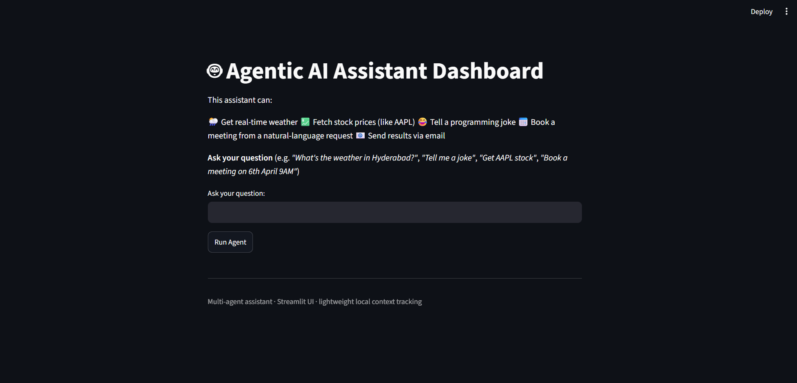
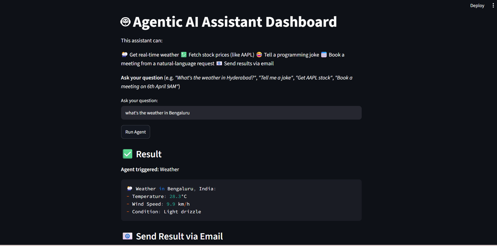
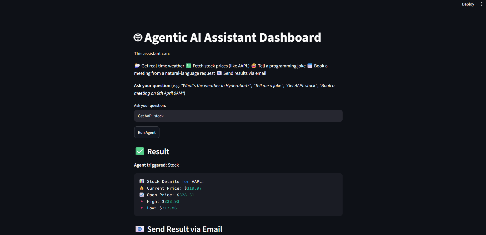
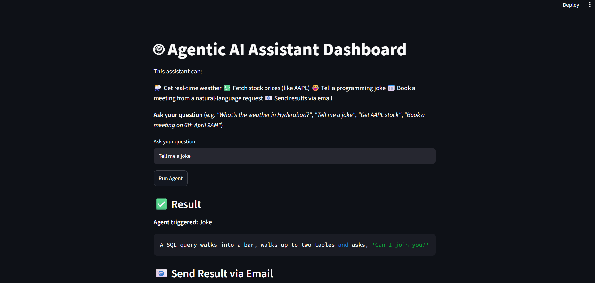
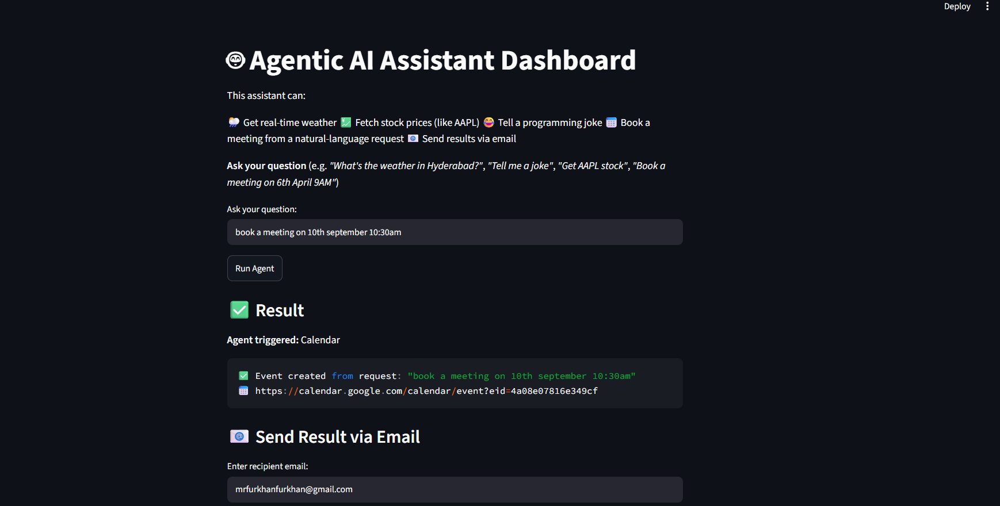
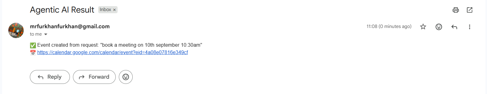
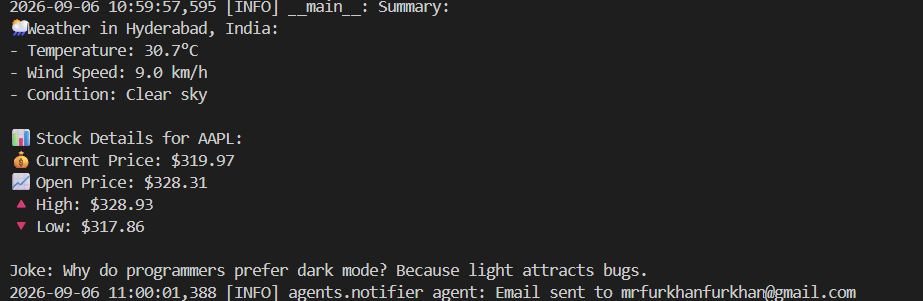
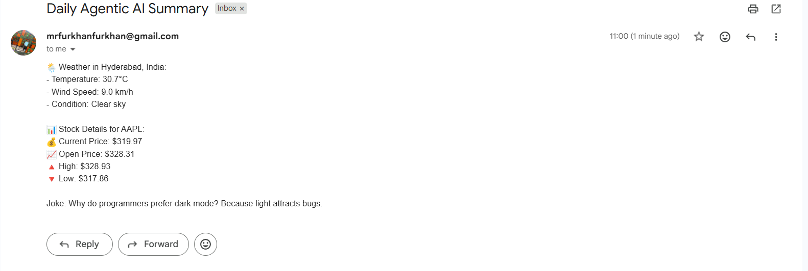

# Multi-Agent Assistant

A lightweight multi-agent assistant built in Python. A small set of independent
"agents" each handle one task (weather, stock prices, jokes, calendar events,
email notifications), coordinated either from a CLI entry point or a Streamlit
dashboard. Agent results are tracked in a shared local JSON context file.

---

## Screenshots

| Dashboard | Weather | Stock information |
|---|---|---|
|  |  |  |

| Joke | Meeting booking | Meeting booked email |
|---|---|---|
|  |  |  |

| Emailed summary | Mail results |
|---|---|
|  |  |

---

## Features

- **Weather** - current conditions for a city via the Open-Meteo API (no API key required)
- **Stocks** - latest OHLC price data for a ticker via `yfinance`
- **Jokes** - a random programming joke
- **Calendar** - creates a calendar event from a natural-language request (placeholder; not yet wired to the real Google Calendar API)
- **Notifications** - emails a summary of results via Gmail SMTP
- **Context tracking** - records each agent's status/result to `context.json`

## Project Structure

```
.
├── main.py                  # CLI entry point — runs weather, stock, joke agents, emails a summary
├── streamlit_app.py         # Streamlit dashboard with a simple keyword-based query router
├── agents/
│   ├── calendar_agent.py    # Natural-language calendar event creation (placeholder)
│   ├── joke_agent.py        # Random programming joke
│   ├── notifier_agent.py    # Email sending via Gmail SMTP
│   ├── stock_agent.py       # Stock price lookup via yfinance
│   └── weather_agent.py     # Current weather via Open-Meteo
├── core/
│   └── context_manager.py   # Shared JSON context read/write helpers
├── tests/
│   └── test_agents.py       # Unit tests for agent logic that doesn't need live credentials
├── Screenshots/               # Dashboard/CLI screenshots used in this README
├── context.json              # Local run state (agent statuses/results)
├── requirements.txt          # Runtime dependencies
├── requirements-dev.txt      # Runtime + test/lint dependencies
├── c.yml                     # CI workflow: install deps, lint with ruff, run pytest
└── LICENSE                   # MIT license
```

> Note: `core/context_manager.py` was renamed from an earlier `mcp/` module to
> avoid a naming clash with the official `mcp` (Model Context Protocol) PyPI
> package. "MCP" in this project's history refers only to the local JSON
> context file, not Anthropic's Model Context Protocol.

## Requirements

- Python 3.11+
- Dependencies listed in `requirements.txt`

## Installation

```bash
git clone https://github.com/Chowdri-Furkhan07/multi-agent-assistant.git
cd multi-agent-assistant
pip install -r requirements.txt
```

For running tests and linting locally:

```bash
pip install -r requirements-dev.txt
```

## Configuration

Create a `.env` file in the project root (loaded automatically via
`python-dotenv`):

```env
# Optional — used by main.py to email a daily summary
NOTIFY_EMAIL=recipient@example.com
EMAIL_SENDER=your_gmail_address@gmail.com
EMAIL_PASSWORD=your_gmail_app_password

# Optional — defaults to AAPL if not set
DEFAULT_STOCK_TICKER=AAPL

# Optional — defaults to context.json if not set
CONTEXT_FILE=context.json
```

`EMAIL_PASSWORD` must be a [Gmail App Password](https://support.google.com/accounts/answer/185833),
not your regular account password. Keep `.env` out of source control.

The weather agent needs no API key (Open-Meteo). The calendar agent is a
placeholder — wiring it up to the real Google Calendar API requires
`google-api-python-client` and OAuth credentials, added inside
`_create_google_calendar_event`.

## Usage

### CLI

Runs the weather, stock, and joke agents, logs a combined summary, records
each result to `context.json`, and emails the summary if `NOTIFY_EMAIL` is set:

```bash
python main.py
```

### Streamlit dashboard

```bash
streamlit run streamlit_app.py
```

Type a natural-language question and click **Run Agent**. Queries are routed
by keyword matching:

| Keywords in query                                        | Agent triggered |
|-----------------------------------------------------------|------------------|
| `weather`, `temperature`, `climate`                        | Weather          |
| `stock`, `price`, `share`                                  | Stock            |
| `joke`, `laugh`, `funny`                                   | Joke             |
| `meeting`, `calendar`, `book`, `appointment`, `schedule`   | Calendar         |

Results can then be emailed to any address from the same page.

## Running Tests

```bash
pytest -v
```

`tests/test_agents.py` covers agent logic that doesn't require live
credentials or network calls that can't be sandboxed (joke generation,
weather error handling, calendar event creation/validation).

## Continuous Integration

`c.yml` runs on every push/PR to `main`: installs `requirements-dev.txt`,
lints with `ruff check .`, and runs `pytest -v`.

---

## Known Limitations

- The calendar agent does not call the real Google Calendar API - it returns
  a placeholder event link.
- Email sending is Gmail-SMTP only; no support for other providers.
- The Streamlit router uses simple keyword matching, not NLU, so ambiguous
  queries may route incorrectly.

---

## Author

**Chowdri Furkhan** - [github.com/Chowdri-Furkhan07](https://github.com/Chowdri-Furkhan07)

---

## License

MIT - see [LICENSE](LICENSE) for details.
